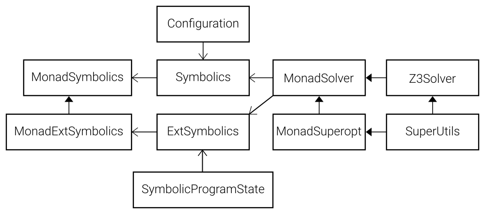

# opti: WebAssembly Superoptimizer
A superoptimizer for WebAssembly; written in Haskell.

> :warning: This is *not* a complete superoptimizer. Instead, it is a research prototype which I used to poke at WebAssembly programs.

This is a superoptimizer to the extend that it relies upon brute-force (and an SMT solver) to optimize programs.

MSc Computer Science project at [Utrecht University](https://www.uu.nl/).

## Running

The superoptimizer is written in Haskell, which you'd likely want to run with GHC. The dependencies are defined with [Stack](https://docs.haskellstack.org/en/stable/README/), which is recommended to run it.

### Prerequisite: Z3
The Z3 theorem prover is required to run this project. The Haskell binding is linked by Stack. The Z3 native library must be priorly present on the machine and discoverable by Stack. Steps:

+ Option 1 (Nix)
    * Install the [Nix](https://nixos.org/) purely functional package manager. Stack will instruct Nix to pull Z3 into the application's environment.
+ Option 2 (Linux)
    * Manually install Z3 through your package manager. This should place Z3 in a location discoverable by Stack.
+ Option 3 (Universal/Win10)
    * Download [Z3](https://github.com/Z3Prover/z3) ([Binaries](https://github.com/Z3Prover/z3/releases) - [4.8.8](https://github.com/Z3Prover/z3/releases/tag/z3-4.8.8) surely works)
    * Add their paths to the global Stack config file (`$STACK_ROOT/config.yaml`) as follows:
      ```yaml
      extra-include-dirs:
      - [Z3 PATH HERE]/include

      extra-lib-dirs:
      - [Z3 PATH HERE]/lib
      ```

### Running it

> :warning: Superoptimizing larger WebAssembly programs/functions may require 64GiB+ of RAM memory. Attempting it on weaker machines *will* cause heavy swap thrashing.

Run it with stack: `stack run`.

Running the superoptimizer with GHCi (interpreter) is *not* recommended for larger programs.

## Features
- [x] WebAssembly AST + Binary Parser + Unparser
- [x] Data Flow Analysis Framework (forward and backward)
  - [x] Liveness Analysis
  - [x] Typechecking
- [x] Bounded Symbolic Execution
- [x] Fragment Equivalence Checking
- [x] Simple Instruction-Sequence Synthesis
- [x] Driving (see Turchin's paper)
- [x] Symbolic Information Propagation
- [x] Simple static optimizations (function removal, drop propagation)
- [x] Partial evaluation (to constants), and branch elimination

## Code Navigation

This project consists of several different parts. Below, several views of its architecture are given.

### File View

This package contains multiple projects (in `projects/`):
* `melude` - *My prelude*. Contains many general functions (and re-exports) which are used throughout the project.
* `wasm-ast` - Representation of the WebAssembly abstract syntax. Closely represents that of the [WebAssembly Specification - (Structure)](https://webassembly.github.io/spec/core/syntax/).
* `wasm-binary` - A parser for the WebAssembly binary format into the AST. See [Binary Format - WebAssembly 1.1](https://webassembly.github.io/spec/core/binary/).
* `wasm-process` - The WebAssembly-specific process tree/graph representations.
* `algorithms` - Some general (non-WASM specific) algorithm implementations. Mainly for dataflow and graphs.

The main projects consists is structured as follows:

* *Main functions* (`app/`) - Several independent analyses which are performed on different parts of the test set.
  * `TestParsing` - Parses `.wasm` files into an AST, then unparses them and writes them to disk.
  * `TestTypeCheck` - Performs type checking on parsed process graphs (both backward and forward); this effectively tests the dataflow implementation (as `.wasm` files are typically type-correct).
  * `TestLiveness` - Runs liveness analysis on several WASM programs, and displays some statistics on the number of live variables.
  * `TestEquivalences` - Runs equivalence checks between 2 functions in WebAssembly modules.
  * `TestReconstruction` - Reconstructs program ASTs from their corresponding process graphs.
  * `TestSynthesis` - Performs program synthesis on fully-driven process trees.
  * `TestPropagate` - Propagates symbolic information over large process graphs. Also performs partial evaluation.
* *Project* (`src/`) - The implementation of the whole-program superoptimizer. Some important modules:
  * `Binding.Z3.` - The interface with the Z3 SMT solver. (Implements `Lang.Wasm.Solver.MonadSolver` for Z3)
  * `Lang.Wasm.`
    * `Dataflow` / `Algebra` / `AlgebraBwd` - Define forward/backward execution of WebAssembly programs, for dataflow analysis.
    * `Dataflow.` - Contains several specific dataflow analyses
    * `Symbolics` - A symbolic environment (= formula set) as necessary from WebAssembly symbolic execution & driving.
    * `Symbolic.` - Symbolic representations of program states
      * `Configuration.` - Symbolically represented state sets
        * `ExecSimple` - Transition function for symbolic information propagation
        * `Propagation` - Transitions defined over flow
      * `ProgramState.` - Symbolic program states (used by synthesis)
        * `ExecSimple` - Symbolic execution over instructions.
        * `Exec` - Symbolic execution of process trees.
    * `Numerics` - Concrete semantics for integer operations (Used by `Symbolics` for formula simplification)
    * `Exec` - Bounded symbolic execution of process trees. (Used by `Synthesis`)
    * `Synthesis` - Generates alternative instruction sequences (Used by `Superopt` to make changes to the tree)
    * `Superopt.` - Superoptimization utilities
      * `MonadSuperOpt` - Superoptimization utilities monad. Provides hard timeouts, soft timeouts, random numbers, logging.
      * `PartialEval` - Performs partial evaluation on a process graph.

### Monad View

Usually, project-specific monads (or type-classes) represent high-level abstractions within the code-base. This image shows an overview of the higher-level abstractions, and their relation to some crucial instances.




## Implementation Philosophies

Some remarks on the applied Haskell code structuring mechanisms.

* Make functions *total*, when possible. If necessary, wrap its result in a `MonadFail`.
* Define data structures such that illegal states are *unrepresentable* (as much as possible).
* Assign functions their *strongest* type (as much as possible).
* For performance (when necessary), use `Int` over `Integer`. Use `IntSet`/`IntMap` when dealing with modification. Use `Vector` for immutable data. (Mainly applies to the graphs)
* Avoid non-functional cheats, such as `unsafePerformIO` or mutable data structures like `MVector` (in `ST`); unless absolutely necessary. (Performance-wise, I haven't seen any difference between `IntMap` and `MVector` for graphs in this project, so then use `IntMap`).
* Typically, avoid Template Haskell. This is a personal preference, as I find it often complicates code and compilation. I do use TH for generating some lenses, if the absence of those lenses would make life even harder. (Trade-off, I guess)

## Known Errors

* Segmentation fault - Occassionally, the superoptimizer may crash through a segmentation fault or *use after free* error in Z3. This happens rarely (but unpredictably); this error is unlikely to reoccur upon *restart*. So, just restart the superoptimizer. The crash also does not seem to occur when running in single-threaded mode; which can be configured in `package.yaml` (but makes it a lot slower).

## Papers
* WebAssembly
  - Haas, A., Rossberg, A., Schuff, D., Titzer, B. (2017). *Bringing the Web up to Speed with WebAssembly*
  - Rossberg., A. (2016). *WebAssembly: high speed at low cost for everyone*
  - Zakai, A. (2013). *Emscripten: An LLVM-to-JavaScript Compiler* ([emscripten source](https://github.com/emscripten-core/emscripten))
* Superoptimization
  - Massalin, A. (1987). *Superoptimizer -- A Look at the Smallest Program*
  - Sasnauskas, R., Chen, Y., Collingbourne, P., Ketema, J., Lup, G., Taneja, J., Regehr, J. (2017). *Souper: A Synthesizing Superoptimizer* ([souper source](https://github.com/google/souper), [slumps source](https://github.com/KTH/slumps))
  - Schkufza, E., Sharma, R., Aiken, A. (2013). *Stochastic Superoptimization* ([stoke source](https://github.com/StanfordPL/stoke))
  - Phothilimthana, P.M., Thakur, A., Bodik, R., Dhurjati, D. (2016). *Scaling up Superoptimization* ([chlorophyll source](https://github.com/mangpo/chlorophyll))
* Driving / Configurations
  - Turchin, V.F. (1986). *The Concept of a Supercompiler*. (not to be confused with super*optimization*)
  - Jones, N.D. (2000). *The Essence of Program Transformation by Partial Evaluation and Driving*

## Credits

* [Z3](https://github.com/Z3Prover/z3)

## License

BSD-3
